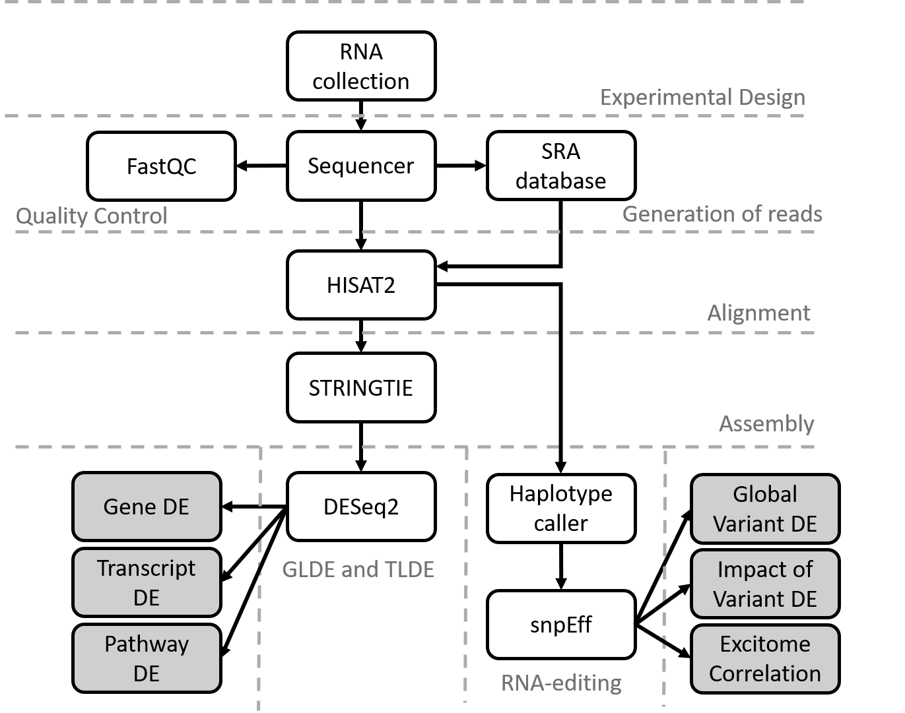

<p align="center">

 </p>
 
<p align="center">Automated Isoform Diversity Detector<p align="center">
 
 ***
 
 # About AIDD
 [](https://zenodo.org/badge/latestdoi/119888778)
 
* AIDD incorporates open source tools into a static virtualbox to ensure reproducability in RNA-seq experiments.  
* There is a bash script that completely automates the pipeline making it ease to use. 
* The manual also instructs the more advanced user how to change the script to add more individual options.  
* It is capable of looking at the transcriptome and editome in both global and local environments.
* It includes a novel ExToolset which can look at all levels of transcriptome diversity in a RNA-seq dataset.
* There is an ability to explore differential expression trends for entire pathways of genes at once with heatmaps and PCA plots.
* There is an options to look at just one gene at time and it's isoform expression as well.
* Variant Calling is used to find evidence of RNA editing and predict the impact effects of those variants.
* Gene enrichment analysis is to highlight pathways affected by variants.

___

#### **AIDDv2.0.0 now allows for** 

* options of aligners, assemblers, and DE tools.
* defining your own directories as well as setup scripts for instance setup.
* analysis of mouse data and more human reference set options.
* analysis of scRNA-seq, miRNAseq, and lcRNAseq in addition to bulk RNAseq.
* normalization of editing sites, multivariate analysis and demension reduction as well as ANOVA and correlation analysis of the excitome. 

___

## Getting Started

These are the directions to download the premade AIDD virtualbox or to create a new vm image with ubuntu 18 and how to use the script to update, download and install all necessary tools for AIDD to run the RNAseq computational pipeline for transcriptome diversity discovery.

### Prerequisites

1. Download and set up oracle virtual box machine 
```
https://www.virtualbox.org/wiki/Downloads 
```
2. Download and install the extension pack as well.

```
https://download.virtualbox.org/virtualbox/5.2.6/Oracle_VM_VirtualBox_Extension_Pack-5.2.6-120293.vbox-extpack

```

### Installing

3. Download our ready to go AIDD virtualbox from the following link.

```
https://drive.google.com/open?id=1bhSZdNznZtQcx8VNlaiysnIoLhVGtfJA

```

4. Uncompress the file.

<p align="center">

 </p>
 
<p align="center">Step 4<p align="center">

 When finished you will have a folder called AIDD in whichever directory you were currently in (Note you need to have 7zip installed to do the uncompression this way).

5. Open Virtualbox manager and under the menu Machine select add.  A new pop window will allow you to find the file you just uncompressed.  Then click open.  AIDD will now appear on your list of virtualboxes.

<p align="center">

 </p>
 
<p align="center">Step 5<p align="center">
	
<p align="center">

 </p>
 
<p align="center">Step 5b<p align="center">
	
<p align="center">

 </p>
 
<p align="center"Step 5c<p align="center">

6. Make sure you check your setting for the machine and you have the correct amount of resources allocated to the virtualbox including RAM and CPU.

* You do this by selecting a virtualbox then clicking on settings.  
* Under the option in the menu on the right select systems. 
* There are two tabs you need to check on the right.  
* Under motherboard make sure the blue marker is in the green portion of the bar for how much RAM to allocate to the virtual box.  
* Do the same under the tab processors.  
* The top green bar is how much CPU to give to virtualbox and this needs to be in the green as well. 

<p align="center">

 </p>
 
<p align="center">Step 6<p align="center">

<p align="center">

 </p>
 
<p align="center">Step 6b<p align="center">
	
7. Set up ashared folder path for the pipeline to store files to.  The virtual box only has enough memory to run to the tools you will need a hard drive external to the virtual box below are the instructions to create the shared folder AIDD on your computer.  Just make sure the hard drive has enough space You will need about 50G for each file or more if you use deep sequencing.  You can also run AIDD in batches if space is a concern.

### How to create a shared folder to store results

A.	create a shared folder on your host system.  

* Create your folder on your host system and make sure you give it share permissions to edit files.
* Name your folder AIDD.
* Go into the setting in the virtualbox and click on shared folders. 
* Click on the folder icon with the + sign on top of it.  

<p align="center">

 </p>
 
<p align="center">Step 1 shared folder setup<p align="center">

* This will create a popup window and you should select you folder path by clicking the drop down option and click on other.  
* This will create a pop up window and you can select your new shared folder AIDD. 

<p align="center">

 </p>
 
<p align="center">Step 2 shared folder setup<p align="center">
	
* Make sure you share your folder in windows right click, then select properties from the drop down menu then click the sharing tab and click the share button

<p align="center">

 </p>
 
<p align="center">Step 3 shared folder setup<p align="center">
	
	<p align="center">

 </p>
 
<p align="center">Step 4 shared folder setup<p align="center">

* After you select the folder the pop up will close and you should make sure the auto-mount box is checked and the read-only box is not checked 

<p align="center">

 </p>
 
<p align="center">Step 5 shared folder setup<p align="center">

* Then click ok.
* Your new folder should show up on the list then click ok.  
* Now start the virtual box and you should see you new folder AIDD under devices in the folder menu.  
* Then use this path for the pipeline it should be /media/sf_AIDD.


<p align="center">

 </p>
 
<p align="center">Step 6 shared folder setup<p align="center">

___

### These are other options to create hard drive space for AIDD however if you plan to run the automated script you have to have a shared folder names AIDD to run as defaults if you choose to do another setup and have more hard drive space on the virtual box or have an instance you are running then you cannot run AIDD with defaults from the icon on the desktop. You will need to enter the following command prompt

```
AIDD.sh 1 /path/to/AIDD/directories /path/to/where/to/put/results
```

___

B.	If you choose the external drive make sure you set up the virtual box to recognize your drive.  

* Do this by going to the settings and selecting USB.  
* Make sure you have the right 2.0 or 3.0 option selected and click add device.  
* Then select the appropriate device from the menu.  
* Then apply changes and restart the virtualbox.  
* The final path should be /media/user/whatever you named you external drive and this needs to be entered in the command prompt instead of /media/AIDD
* Alternatively you can add a folder to the external drive and then share this folder as described in A

C.	If you choose the internal drive use these instructions to add an internal hard drive space. 

* Click settings and then select Storage.  
* Highlight Controller: SATA and then at the bottom there is a blue drive button with a green plus select this one.  
* Two options will appear select the add hard disk option.  
* Click create new disk and in the new window select VHD (virtual hard disk) then click Next.  
* Select Dynamically allocated up to appropriate size for your project and machine we suggest no smaller then 500GB. 
* The new drive should appear in the list.  
* Now you can open the virtual machine and you will have to format the new disk before you can use it.  
* Go to search computer and type in disks. 
* Click on the disks icon that appears. 
* A new window will pop up and on the left will be a list of disks.  
* Select your new hard drive and then click on the circle icon in the upper right corner which is the settings menu.  
* Select format from this menu.  
* In the new window select quick overwrite and click format. 
* Once this is done select the + icon near the middle of the window.  
* In the new pop up window don’t change any options just add a name in the name box.  
* Once this is done close click the triangle “play” button to mount the drive and close the windows.  
* Your new drive should appear below computer in the folder menu.  
* Supply this path to the first prompt in the pipeline.  
* The final path should be /media/user/”whatever you named it”

___

### Creating personal VM to run AIDD or you can follow the same instructions to create an ubuntu instance to run on server such as amazon just start with step 5 and enter that command into your previously set up instance version of ubuntu 18 instance
(advanced users who want to make adjustment to default settings)
If you prefer to create your own virtualbox instead of downloading the premade image follow this next series of steps.  But you do not have to do these if you are going to use the premade virutalbox.

1. use the following link to download ubuntu 18.04 (other version of ubuntu might not install the tools correctly).
```
http://releases.ubuntu.com/18.04/
```
if you wish to create a new VM click the desktop image
if you wish to create a instance then click the instance image
and wait for it to finish downloading before moving on to the next steps

2. Go to create new machine in the oracle virtual machine window by clicking the new button

* select a name, put in linux and ubuntu 64 
* then click VDH create virtual hard disk now and select at least 40G of storage space to create the hard disk.  
* Click create

3. When it asks where to load from click on ubuntu 18.04 file in your file system.
 
 * This will tell VM were to get install files from.
 * then install ubuntu following prompts until it is done.
   first click install
   then use default english highlighted
   then select minimal installation and make sure third-party software is turned off then click continue
   select the option erase disk and install ubuntu then click install now
   click continue when the warning message pops up
   then click continue
   userMake sure you use username = user and password = password you can also select to log in automatically but it really does not make a difference then click continue
 * Now ubuntu is installing when it is finished it will ask you to reset even if you follow the prompt for a system reset you still need to manually close you VM by clicking on the X and make sure you poweroff not save the state and re-start but before you restart do step
 
4. Make sure you have set aside enough RAM and CPU to run the machine you must select at least 6G of RAM and 1CPU to run at bare minimum (although at 16G is recommended to ensure accurate variant calling).  

* Please note to run STAR aligner option you must select at least 40G of RAM.  
* Check the settings system.  
* Then check motherboard and processor make sure all the blue markers are in the green for your machine if not then you need to find a computer with the required specs to run AIDD fully.  

5. Now restart your newly creaeted VM

* click on the devices tab and from the drop down menu select install

6.  Once you load your new virtual box open command prompt.  When your VM starts it will have a pop up just click next until you can click done then this will close that window. If it asks you to do updates click on no. 

7. Next you need to get and run AIDD Instance setup scripts from github.  Download scripts by copy and paste the following command into the terminal.

```
sudo apt-get install git
git clone https://github.com/RNAdetective/AIDD.git
chmod +x /home/user/AIDD/Instancesetup/set_up.sh
cp ~/AIDD/Desktop/Setup_AIDD.desktop ~/Desktop
chmod +x ~/Desktop/Setup_AIDD.desktop
```
Now you are ready to install AIDD by double clicking the icon on the desktop Setup_AIDD

8. The program will run and ask you for the following prompts

* Follow instructions while setup runs 
    first it will ask you to supply a password
    oracle will prompt you to hit enter to install updates for java and to install both java versions needed for the pipeline
    then do you want to continue type y
    then a pop up window will ask you to hit ok then make sure you pick yes and hit enter
    When operating system and basic tools are done updating then AIDDtools are downloaded and installed from static copies
    then next pop up will ask you to hit enter
    it finish after it downloads the AIDD scripts from github.

Close the virtualbox and restart again Then from the devices tab select insert guest additions CD image. When it asks if you would like to run the CD image click yes then enter the password for user then click authenticate.  Let the command run then when prompt hit return to close the window.

Then paste the following command into the terminal to add shared folders to your virtual image

```
sudo usermod -a -G vboxsf user
```
	
### After this script is done copy and paste the following in the terminal to install the Rpackages needed to run AIDD

```
sudo su
# enter your password
```
Then copy the following

```
Rscript /home/user/Instancesetup/set_up.R

```
Then you should shutdown the VM
make sure you go back and create a shared folder if you didnot make your virtual harddrive big enough to store all your data also make sure you adjust the processor and RAM according to the directions above to the right settings for AIDD and then restart the VM to run AIDD.

___

## ZIKV with RMD for R-studio

To run the tutorial open R studio and find the AIDDtutorial.rmd file under /home/user/AIDD/AIDD/AIDDtutorial.rmd.  Run the chunks from begining to end.  This tutorial explains each step of the AIDD pipeline and allow for user to change code as necessry.
The tutorial allows for both understanding of the tools and statistical analysis performed by AIDD and can be used as an educational tool for hands on teaching of bioinformatic analysis of RNA sequencing data.

Another option to run the tutorial to test for installation of tools is to simply run AIDD without changing any of the PHENO_DATA.csv file or adding anything to the directories on the desktop. AIDD is set to run the tutorial right "out of the box".

___

## Running AIDD

To Run AIDD for RNAseq transcriptome diversity discovery copy and paste the following command and follow the on screen prompts.  For detailed instructions as well as ways to edit the script for even more options see the manual.

Step 1: Make sure AIDD virutalbox is up an running following the steps outlined above and make sure that you have opened this github page in AIDD by using the web browser (if you do not open a new web browser in AIDD and continue using the one on your main computer then you will not be able to copy and paste from github into the terminal so you will have to maually type the command into the terminal).

Step 2: Follow the instructions on the desktop.
* 1.) Open PHENO_DATA.csv on the desktop and fill out for your experiment.

<p align="center">

 </p>
 
<p align="center">Set up your PHENO_DATA file<p align="center">

        * a.) On the desktop you will find a file PHENO_DATA.csv add your experimental information into this file
        
        * b.) column 1: the sample names for each sample you wish to use to label graphs and tables for the results.
        
        * c.) column 2: the SRA run identification number or the name of the .fastq file you are using from non-public data.
        
        * d.) column 3: this is the main condition for the experiment for example AML or healthy (make sure to use this term instead of control). DO NOT use the word control because DESeq2 will not accept this as a condition.
        
        * e.) column 4: this is the sample number used to create matrix it is just sample01-sample what ever your last sample number is. Make sure if you have over a hundred samples that you use sample001. 
        
        * f.) column 5-6: these are addition conditions to be with multivariate analysis if you do not have any additional conditions leave them empty.
        
        * g.) Now save the new data with the same name on the desktop.
The next four steps 2-5 are optional if you don't have any genes of interest or pathways to investigate skip these and go right to running AIDD step 3.

* 2.) Insert any gene lists of interest into the insert_gene_of_interest folder on the desk top.  Make .csv files with the first column numbered 1-X.  Then in the second column list your genes you want on one bar graph.  Also open GOI.csv and add to the list of genes any you want line graph count graphs for as well as a included in the table of gene of interest results.

<p align="center">

 </p>
 
<p align="center">insert gene of interest files<p align="center">

* 3.) Do the same for transcript lists of interest into the insert_transcript_of_interest fold making sure you add your transcript of interest to the TOI.csv file.

<p align="center">

 </p>
 
<p align="center">insert transcript of interest files<p align="center">

* 4.) Add any pathway lists to the insert_gene_lists_for_pathways folder on the desktop.  Make a csv file that contains the first column labeled gene numbered 1-X.  Then in the second column labeled gene_name enter as many genes you want to include in that pathway.  Then name the file XXXXXXXX.csv (the name of your pathway) then add this name to the csv file pathway_list in the same format as the others on the list.

<p align="center">

 </p>
 
<p align="center">insert gene lists you want to perform pathway DE analysis on files<p align="center">

* 5.) repeat this same procedure but for the insert_transcript_lists_for_pathways folder on the desktop.  Making sure to add you pathway names to the csv file names pathwayT_list.

<p align="center">

 </p>
 
<p align="center">insert transcript lists you want to perform pathway DE analysis on files<p align="center">

Step 3: Simply double click the icon labeled Run_AIDD on the desktop to run AIDD with default settings.

If you needed to install AIDD anywhere other then the defualt VM /home/user directory or want the output data stored somewhere other then the default /media/sf_AIDD/AIDD_data you need to specify this in the command line as explained below.

copy and paste the following command into the command prompt

```
bash AIDD.sh 1 /path/to/AIDD /path/to/store/data
```
<p align="center">

 </p>
 
<p align="center">Run AIDD with defaults see manual to customize<p align="center">
	
If you are running AIDD for the first time without using the prepared VM then you need to download references to use. To do this simply copy and paste the following command

```
bash AIDD.sh 2 /path/to/AIDD /path/to/store/data
```

Then follow the on screen prompts answering 1 when you want the defaults and 2 when you want a different option as defined by the on screen prompt.

For more details on options available for AIDD please see the manual here on github or included in you AIDD folder on the VM.

___

## Pipeline Flow Chart


## Built With
* [SRAtoolkit] (https://www.ncbi.nlm.nih.gov/sra/docs/toolkitsoft/)
* [Fastx-Toolkit] (http://hannonlab.cshl.edu/fastx_toolkit/)
* [Samtools] (http://samtools.sourceforge.net/)
* [HISAT2] (https://ccb.jhu.edu/software/hisat2/index.shtml)
* [STAR] (https://github.com/alexdobin/STAR)
* [Bowtie2] (http://bowtie-bio.sourceforge.net/bowtie2/index.shtml)
* [Kallisto] (https://pachterlab.github.io/kallisto/about)
* [Salmon] (http://salmon.readthedocs.io/en/latest/salmon.html)
* [Picard] (http://broadinstitute.github.io/picard/)
* [Stringtie] (https://ccb.jhu.edu/software/stringtie/)
* [Cuffdiff/Cufflinks] (http://cole-trapnell-lab.github.io/cufflinks/cuffdiff/)
* [GATK] (https://software.broadinstitute.org/gatk/)
* [snpEff] (http://snpeff.sourceforge.net/)


R packages
* [Bioconductor packages] (https://www.bioconductor.org/)
* [DESeq2] (https://bioconductor.org/packages/release/bioc/html/DESeq2.html)
* [DEXseq] (http://bioconductor.org/packages/release/bioc/html/DEXSeq.html)
* [Ballgown] (http://bioconductor.org/packages/release/bioc/html/ballgown.html)
* [Ggplot2] (https://cran.r-project.org/web/packages/ggplot2/index.html)
* [topGO] (http://bioconductor.org/packages/release/bioc/html/topGO.html)

___

## References for tools.

Auwera, G. A. Van Der, Carneiro, M. O., Hartl, C., Poplin, R., Levy-moonshine, A., Jordan, T., … Depristo, M. A. (2014). From FastQ data to high confidence varant calls: the Genome Analysis Toolkit best practices pipeline. Curr Protoc Bioinformatics (Vol. 11). http://doi.org/10.1002/0471250953.bi1110s43.From

Depristo, M. A., Banks, E., Poplin, R., Garimella, K. V., Maguire, J. R., Hartl, C., … Daly, M. J. (2011). A framework for variation discovery and genotyping using next-generation DNA sequencing data. Nature Genetics, 43(5), 491–501. http://doi.org/10.1038/ng.806

Dobin A, Davis CA, Schlesinger F, et al. STAR: ultrafast universal RNA-seq aligner. Bioinformatics. 2012;29(1):15-21. 

Kim, D., Langmead, B., & Salzberg, S. L. (2015). HISAT: a fast spliced aligner with low memory requirements. Nature Methods, 12(4), 357–360. http://doi.org/10.1038/nmeth.3317

Langmead B, Salzberg S. Fast gapped-read alignment with Bowtie 2. Nature Methods. 2012, 9:357-359.

Li, H. (2011). A statistical framework for SNP calling, mutation discovery, association mapping and population genetical parameter estimation from sequencing data. Bioinformatics, 27(21), 2987–2993. http://doi.org/10.1093/bioinformatics/btr509

Li, H., Handsaker, B., Wysoker, A., Fennell, T., Ruan, J., Homer, N., … Durbin, R. (2009). The Sequence Alignment/Map format and SAMtools. Bioinformatics, 25(16), 2078–2079. http://doi.org/10.1093/bioinformatics/btp352

Love, M. I., Huber, W., & Anders, S. (2014). Moderated estimation of fold change and dispersion for RNA-seq data with DESeq2. Genome Biology, 15(12). http://doi.org/10.1186/s13059-014-0550-8

McKenna, A., Hanna, M., Banks, E., Sivachenko, A., Cibulskis, K., Kernytsky, A., … DePristo, M. A. (2010). The Genome Analysis Toolkit: A MapReduce framework for analyzing next-generation DNA sequencing data. Genome Research, 20(9), 1297–1303. http://doi.org/10.1101/gr.107524.110

Pertea, M., Kim, D., Pertea, G., Leek, J. T., & Steven, L. (2017). HHS Public Access, 11(9), 1650–1667. http://doi.org/10.1038/nprot.2016.095.Transcript-level

Pertea, M., Pertea, G. M., Antonescu, C. M., Chang, T.-C., Mendell, J. T., & Salzberg, S. L. (2015). StringTie enables improved reconstruction of a transcriptome from RNA-seq reads. Nature Biotechnology, 33(3), 290–295. http://doi.org/10.1038/nbt.3122

___
