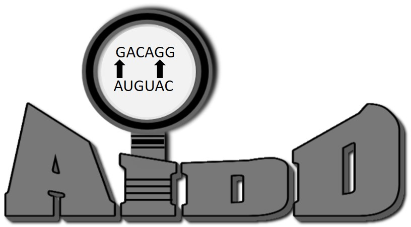
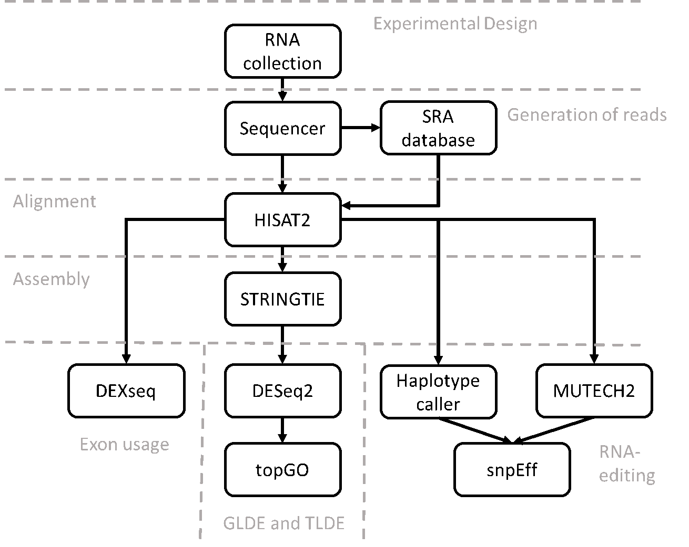

# Automated Isoform Diversity Detector: AIDD
* AIDD incorporates open source tools into a static virtualbox to ensure reproducability.  
* There is a bash script that completely automates the pipeline making it ease to use. 
* The manual also instructs the more advanced user how to change the script to add more individual options.  
* It is capable of looking at the transcriptome and editome in both global and local environments.
* There is an ability to explore differential expression trends for entire pathways of genes at once with heatmaps and PCA plots.
* There is an options to look at just one gene at time and it's isoform expression as well.
* Variant Calling is used to find evidence of RNA editing and predict the impact effects of those variants.
* Gene enrichment analysis is to highlight pathways affected by variants.

## Getting Started

These are the directions to download the premade AIDD virtualbox or to create a new vm image with biolinux8 and how to use the script to update, download and install all necessary tools for AIDD to run the RNAseq computational pipeline for transcriptome diversity discovery.  We will soon add the ability to use docker.

### Prerequisites

1. Download and set up oracle virtual box machine 
```
https://www.virtualbox.org/wiki/Downloads 
```
2. Download and install the extension pack as well.
```
https://download.virtualbox.org/virtualbox/5.2.6/Oracle_VM_VirtualBox_Extension_Pack-5.2.6-120293.vbox-extpack
```

### Installing

3. Download our ready to go AIDD virtualbox.
```
https://drive.google.com/open?id=1ySfznZt8x50Vc0wVGP1U56vWd4TuV_Gh
```
4. Uncompress files.

5. Open Virtualbox manager and under the menu Machine select add.  A new pop window will allow you to find the file you just uncompressed.  Then click open.  AIDDv2.0 will now appear on your list of virtualboxes.

6. Make sure you check your setting for the machine and you have the correct amount of resources allocated to the virtualbox including RAM and CPU.

* You do this by selecting a virtualbox then clicking on settings.  
* Under the option in the menu on the right select systems. 
* There are two tabs you need to check on the right.  
* Under motherboard make sure the blue marker is in the green portion of the bar for how much RAM to allocate to the virtual box.  
* Do the same under the tab processors.  
* The top green bar is how much CPU to give to virtualbox and this needs to be in the green as well. 

7. Set up external, internal hard drive, or shared folder path for the pipeline to store files to.  The virtual box only has enough memory to run to the tools you will need a hard drive external to the virtual box below are the three options you have and instructions to create each of them.  Just make sure the hard drive has enough space You will need about 50G for each file or more if you use deep sequencing.  The pipeline is designed to run automated from a shared folder so if you choose to run the automated script you need to have set up option C.

A.	If you choose the external drive make sure you set up the virtual box to recognize your drive.  

* Do this by going to the settings and selecting USB.  
* Make sure you have the right 2.0 or 3.0 option selected and click add device.  
* Then select the appropriate device from the menu.  
* Then apply changes and restart the virtualbox.  
* The final path should be /media/user/whatever you named you external drive

B.	If you choose the internal drive use these instructions to add an internal hard drive space. 

* Click settings and then select Storage.  
* Highlight Controller: SATA and then at the bottom there is a blue drive button with a green plus select this one.  
* Two options will appear select the add hard disk option.  
* Click create new disk and in the new window select VHD (virtual hard disk) then click Next.  
* Select Dynamically allocated up to appropriate size for your project and machine we suggest no smaller then 500GB. 
* The new drive should appear in the list.  
* Now you can open the virtual machine and you will have to format the new disk before you can use it.  
* Go to search computer and type in disks. 
* Click on the disks icon that appears. 
* A new window will pop up and on the left will be a list of disks.  
* Select your new hard drive and then click on the circle icon in the upper right corner which is the settings menu.  
* Select format from this menu.  
* In the new window select quick overwrite and click format. 
* Once this is done select the + icon near the middle of the window.  
* In the new pop up window don’t change any options just add a name in the name box.  
* Once this is done close click the triangle “play” button to mount the drive and close the windows.  
* Your new drive should appear below computer in the folder menu.  
* Supply this path to the first prompt in the pipeline.  
* The final path should be /media/user/”whatever you named it”

C.	The last option is to create a shared folder on your host system.  

* Create your folder on your host system and make sure you give it share permissions.  
* Go into the setting in the virtualbox and click on shared folders. 
* Click on the folder icon with the + sign on top of it.  
* This will create a popup window and you should select you folder path by clicking the drop down option and click on other.  
* This will create a pop up window and you can select your new shared folder. 
* After you select the folder the pop up will close and you should make sure the auto-mount box is checked and make permanent box if you want the folder to stay shared for more then one session.  
* Then click ok.  
* Your new folder should show up on the list then click ok.  
* Now start the virtual box and you should see you new folder under devices in the folder menu.  
* Then use this path for the pipeline it should be /media/sf_”name of folder”.

### Creating VM

If you prefer to create your own virtualbox instead of downloading the premade image follow this next series of steps.  But you do not have to do these if you are going to use the premade virutalbox.

1. use the following link to download biolinux8 the .iso file not the .ova file for the vm.
```
http://nebc.nerc.ac.uk/downloads/bio-linux-8-latest.iso
```
2. Go to create new machine in the oracle virtual machine window by clicking the new button

* select a name, put in linux and ubuntu 64 
* then click VDH create virtual hard disk now and select at least 40G of storage space to create the hard disk.  
* Click create

3. When it asks where to load from click on bio linux 8 .iso file in your file system.
 
 * This will then load the iso file and it is just like you are installing a new os.
 * then install biolinux following prompts until it is done.
 * Hit Continue make sure you erase disk options and keep clicking continue
 * Make sure you use username = user and password = password
 * When you click restart wait about 15 seconds and you can close the virtualbox and click the option shutdown machine.
 
4. Make sure you have set aside enough RAM and CPU to run the machine you must select at least 4G of RAM and 1CPU to run at bare minimum.  

* (Although to run STAR aligner option you must select at least 30G of RAM).  
* Check the settings system.  
* Then check motherboard and processor make sure all the blue markers are in the green for your machine.  

5.  Once you load your new virtual box open command prompt and copy paste the following commands
```
wget https://github.com/nplonsk2/AIDD/raw/master/VMsetup.tar.gz

tar -xvzf VMsetup.tar.gz

bash /home/user/VMsetup/set_up.sh
```
6. The program will run and ask you for the following prompts

* The first prompt will ask you for the password which is password
* The second prompt will ask to hit enter
* The third prompt will ask which version you want to keep you want to keep current version you want the default hit n
* The fourth promt It will prompt for the password again enter password
* The fifth prompt will ask for you to pick which verison of Java you would like to use the options are 0 1 2 you want to hit 2
* The sixth prompt will ask for you to hit enter again

7. once the operating system and programs are ready copy and paste the following to run the R package setup
```
##this first command runs command at the root

sudo su

##copy and paste the following in the root directory prompt

Rscript /home/user/AIDD/Rscripts/install_packages.R

##if the script runs into a error where it asks the user for input just exit out and run it again and that should fix the error.
Once the Rscript is done running.  
```
Close the virtualbox and restart again.  Now you should be able to click on view and click on the last option virtual screen 1.  A side bar will pop up and you can select the proper screen resolution for your computer. You can hold right ctrl and press c to adjust to fill mode then make the window larger.  This right ctrl + c with toggle between these two views.

You now have a newly constructed copy of AIDDv2.0virtualbox and you must conitnue from step 5 above Installing

## Zika Tutorial with RMD for R-studio

To run the tutorial open R studio and find the AIDDtutorial.rmd file under /home/user/AIDD/tutorial/AIDDtutorial.rmd.  Run the chunks from begining to end.  This tutorial explains each step of the AIDD pipeline.  The following running AIDD is using the automated script  to look at the details of these scripts please look in /home/user/AIDD/bsahScripts or /home/user/AIDD/Rscripts

## Running AIDD

To Run AIDD for RNAseq transcriptome diversity discovery copy and paste the following command and follow the on screen prompts.  For detailed instructions as well as ways to edit the script for even more options see the manual.

Step 1: Make sure AIDD virutalbox is up an running following the steps outlined above.

Step 2: Follow the instructions on the desktop.
* 1.) Open PHENO_DATA.csv on the desktop and fill out for your experiment.

* 2.) Insert any gene lists of interest into the insert_gene_of_interest folder on the desk top.  Make .csv files with the first column numbered 1-X.  Then in the second column list your genes you want on one bar graph.  Also open GOI.csv and add to the list of genes any you want line graph count graphs for as well as a included in the table of gene of interest results.

* 3.) Do the same for transcript lists of interest into the insert_transcript_of_interest fold making sure you add your transcript of interest to the TOI.csv file.

* 4.) Add any pathway lists to the insert_gene_lists_for_pathways folder on the desktop.  Make a csv file that contains the first column labeled gene numbered 1-X.  Then in the second column labeled gene_name enter as many genes you want to include in that pathway.  Then name the file XXXXXXXX.csv (the name of your pathway) then add this name to the csv file pathway_list in the same format as the others on the list.

* 5.) repeat this same procedure but for the insert_transcript_lists_for_pathways folder on the desktop.  Making sure to add you pathway names to the csv file names pathwayT_list.

* 6.) When you are done entering the specifics for your experiment then copy and paste this into the command line and then follow on screen prompts.
```
bash /home/user/AIDD/AIDD.sh
```
Step 3: copy and paste the following command into the command prompt

```
bash /home/user/AIDD/AIDD.sh
```
Step 4: Follow on screen prompts asking a few more detail about your specific experiment.  If you would like to run with our predefined defaults select that in the beginning.

AIDD will then run telling what it is doing at each step along the way.  When it is complete it will have all results in your shared folder organized by type of data.  See the manual for more information about folder system structure.  

## Pipeline Flow Chart

## Built With
* [SRAtoolkit] (https://www.ncbi.nlm.nih.gov/sra/docs/toolkitsoft/)
* [Samtools] (http://samtools.sourceforge.net/)
* [HISAT2] (https://ccb.jhu.edu/software/hisat2/index.shtml)
* [Picard] (http://broadinstitute.github.io/picard/)
* [Stringtie] (https://ccb.jhu.edu/software/stringtie/)
* [STAR] (https://github.com/alexdobin/STAR)
* [Cuffdiff/Cufflinks] (http://cole-trapnell-lab.github.io/cufflinks/cuffdiff/)
* [Kallisto] (https://pachterlab.github.io/kallisto/about)
* [Salmon] (http://salmon.readthedocs.io/en/latest/salmon.html)
* [GATK] (https://software.broadinstitute.org/gatk/)
* [snpEff] (http://snpeff.sourceforge.net/)


R packages
* [Bioconductor packages] (https://www.bioconductor.org/)
* [DESeq2] (https://bioconductor.org/packages/release/bioc/html/DESeq2.html)
* [DEXseq] (http://bioconductor.org/packages/release/bioc/html/DEXSeq.html)
* [Ballgown] (http://bioconductor.org/packages/release/bioc/html/ballgown.html)
* [Ggplot2] (https://cran.r-project.org/web/packages/ggplot2/index.html)
* [topGO] (http://bioconductor.org/packages/release/bioc/html/topGO.html)

## References for tools.
Auwera, G. A. Van Der, Carneiro, M. O., Hartl, C., Poplin, R., Levy-moonshine, A., Jordan, T., … Depristo, M. A. (2014). From FastQ data to high confidence varant calls: the Genome Analysis Toolkit best practices pipeline. Curr Protoc Bioinformatics (Vol. 11). http://doi.org/10.1002/0471250953.bi1110s43.From

Depristo, M. A., Banks, E., Poplin, R., Garimella, K. V., Maguire, J. R., Hartl, C., … Daly, M. J. (2011). A framework for variation discovery and genotyping using next-generation DNA sequencing data. Nature Genetics, 43(5), 491–501. http://doi.org/10.1038/ng.806

Kim, D., Langmead, B., & Salzberg, S. L. (2015). HISAT: a fast spliced aligner with low memory requirements. Nature Methods, 12(4), 357–360. http://doi.org/10.1038/nmeth.3317

Li, H. (2011). A statistical framework for SNP calling, mutation discovery, association mapping and population genetical parameter estimation from sequencing data. Bioinformatics, 27(21), 2987–2993. http://doi.org/10.1093/bioinformatics/btr509

Li, H., Handsaker, B., Wysoker, A., Fennell, T., Ruan, J., Homer, N., … Durbin, R. (2009). The Sequence Alignment/Map format and SAMtools. Bioinformatics, 25(16), 2078–2079. http://doi.org/10.1093/bioinformatics/btp352

Love, M. I., Huber, W., & Anders, S. (2014). Moderated estimation of fold change and dispersion for RNA-seq data with DESeq2. Genome Biology, 15(12). http://doi.org/10.1186/s13059-014-0550-8

McKenna, A., Hanna, M., Banks, E., Sivachenko, A., Cibulskis, K., Kernytsky, A., … DePristo, M. A. (2010). The Genome Analysis Toolkit: A MapReduce framework for analyzing next-generation DNA sequencing data. Genome Research, 20(9), 1297–1303. http://doi.org/10.1101/gr.107524.110

Pertea, M., Kim, D., Pertea, G., Leek, J. T., & Steven, L. (2017). HHS Public Access, 11(9), 1650–1667. http://doi.org/10.1038/nprot.2016.095.Transcript-level

Pertea, M., Pertea, G. M., Antonescu, C. M., Chang, T.-C., Mendell, J. T., & Salzberg, S. L. (2015). StringTie enables improved reconstruction of a transcriptome from RNA-seq reads. Nature Biotechnology, 33(3), 290–295. http://doi.org/10.1038/nbt.3122
